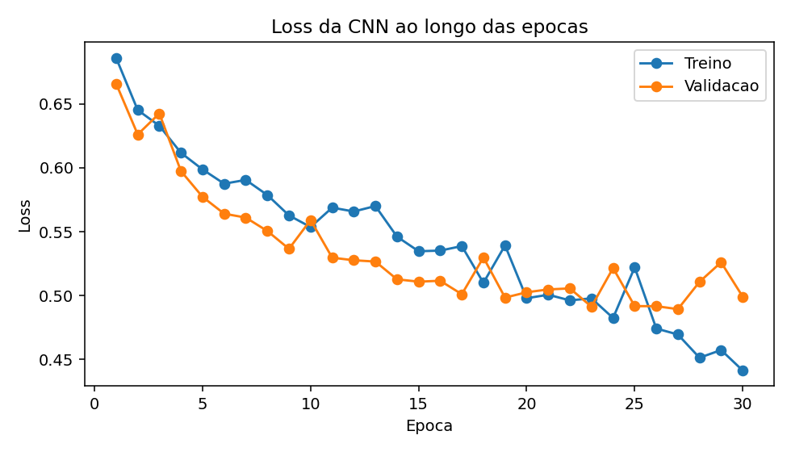
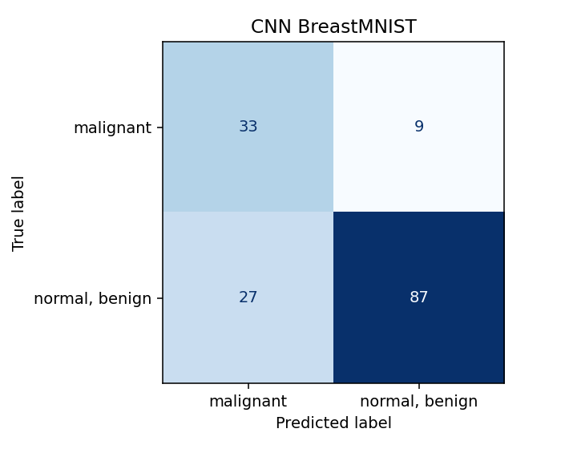
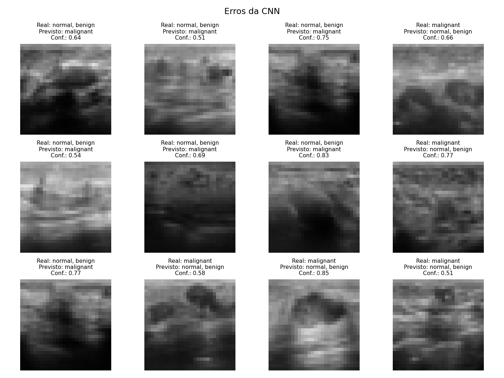
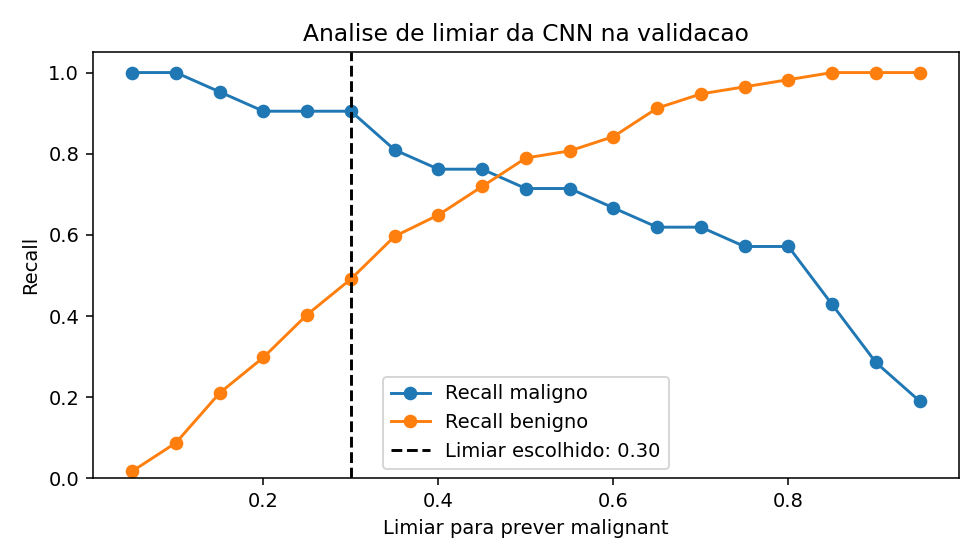
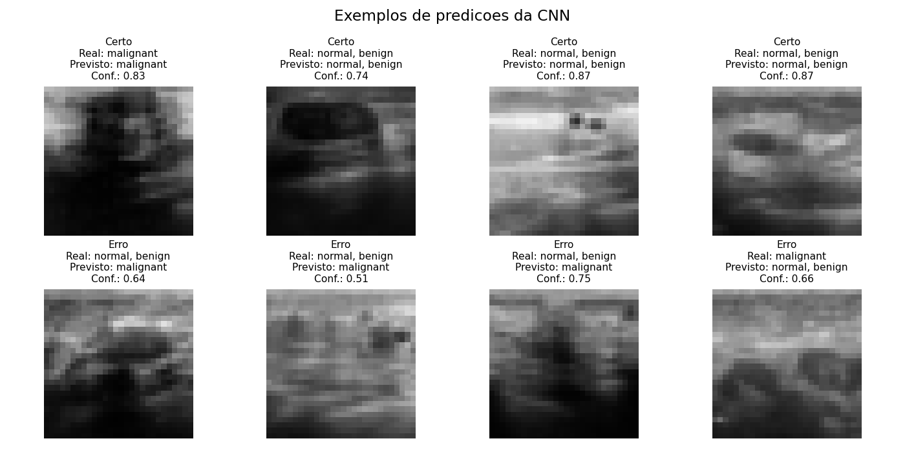

# Semana 4 -  Rede Convolucional com PyTorch

Nesta semana o objetivo foi usar uma CNN, ou seja, uma rede neuronal convolucional, para classificar imagens do BreastMNIST. Continuei com este dataset porque assim o trabalho mantém sempre a mesma linha o que faz mais sentido : cancro da mama, primeiro com dados tabulares, depois com imagens e por fim com uma rede feita mesmo para imagens.

No fundo, esta semana serve para fechar a evolução do trabalho. Na Semana 1 usei 30 características numéricas já extraídas das imagens. Na Semana 2 explorei as imagens médicas propriamente ditas. Na Semana 3 achatei as imagens e tratei os pixels como se fossem uma tabela. Agora, na Semana 4, usei uma CNN para tentar aproveitar melhor a estrutura da imagem.

## Resumo do caminho feito até aqui

Antes de explicar a CNN, acho importante resumir o que foi feito nas semanas anteriores, porque a Semana 4 só faz sentido quando é comparada com elas.

Na Semana 1 trabalhei com o dataset `load_breast_cancer`, que não tem a imagem original. Tem 30 valores numéricos por amostra, que já tinham sido extraídos das imagens. Isto facilitou bastante o trabalho do modelo, porque ele recebeu variáveis já pensadas por alguém. A `LogisticRegression` teve uma accuracy muito alta, perto de 0.9825, mas isso também mostra uma limitação: o modelo não estava a "ver" a imagem, estava a trabalhar com um resumo dela.

Na Semana 2 passei para imagens médicas do MedMNIST. Aqui já temos a imagem em si, em formato de tensor. No BreastMNIST, cada imagem tem 28x28 pixels e 1 canal, porque é em escala de cinzento. Nesta parte percebi que o dataset está desequilibrado: há muitos mais casos `normal/benign` do que `malignant`. Isto é importante porque, se não tivermos cuidado, o modelo pode aprender a favorecer a classe que aparece mais vezes.

Na Semana 3 usei os pixels diretamente, mas de forma simples: achatei cada imagem 28x28 para uma lista com 784 valores. Assim consegui usar modelos clássicos, como `LogisticRegression` e `SVC`. O problema é que, ao fazer isto, a imagem deixa de ser uma imagem para o modelo. Passa a ser uma linha gigante de números. O modelo sabe os valores dos pixels, mas perde a ideia natural de vizinhança, contornos e regiões da imagem.

Por isso é que a CNN faz sentido nesta Semana 4. Em vez de receber a imagem como uma lista, a CNN recebe a imagem mantendo a estrutura:

```text
batch x canais x altura x largura
N x 1 x 28 x 28
```

Isto quer dizer que o modelo consegue olhar para pequenas zonas da imagem e aprender filtros. Esses filtros podem ajudar a detetar padrões como zonas mais escuras, contornos, texturas ou diferenças de contraste.

## Como funciona uma CNN

Uma CNN é uma rede neuronal feita especialmente para imagens. A grande diferença em relação ao que fiz na Semana 3 é que a CNN não começa por transformar a imagem numa lista de números. Ela mantém a imagem com altura, largura e canais.

Para perceber isto, podemos pensar numa imagem como uma grelha. No BreastMNIST, essa grelha tem 28 linhas e 28 colunas. Cada quadradinho dessa grelha é um pixel. Como as imagens são em escala de cinzento, cada pixel só precisa de um valor, que representa se está mais escuro ou mais claro. Por isso dizemos que a imagem tem 1 canal.

Um canal é como uma camada de informação da imagem. Numa imagem a preto e branco/cinzento existe só uma camada: a intensidade da luz. Numa imagem RGB normal existem 3 canais: vermelho REd, verde GREEN e azul BLUE. Por exemplo, uma fotografia a cores pode ser vista como três imagens sobrepostas, uma para cada cor. No BreastMNIST isto não acontece, porque a imagem não tem cor, só tem tons de cinzento.

Então, quando digo que a entrada é:

```text
1 x 28 x 28
```

estou a dizer:

```text
1 canal x 28 linhas x 28 colunas
```

Ou seja, a CNN recebe uma imagem pequena em tons de cinzento.

A parte mais importante da CNN são as convoluções. Uma convolução pode ser imaginada como uma pequena janela que passa por cima da imagem. Essa janela chama-se filtro ou kernel. Em vez de olhar para a imagem toda de uma vez, a CNN olha para zonas pequenas, por exemplo 3x3 pixels de cada vez. É como se o modelo passasse uma lupa pela imagem à procura de certos padrões.

No início, esses filtros ainda não sabem procurar nada útil. Estão praticamente aleatórios. Durante o treino, a rede vai ajustando esses filtros. Com o tempo, alguns filtros podem começar a reagir mais a contornos, outros a zonas escuras, outros a mudanças de contraste ou a texturas. Eu não digo ao modelo manualmente "procura este contorno". A CNN tenta aprender isso a partir dos exemplos de treino.

Depois da convolução uso `ReLU`. A `ReLU` é uma função simples que corta os valores negativos e deixa passar os positivos. Uma forma simples de pensar nisto é: se uma zona não ativou o filtro, fica a zero; se ativou, mantém informação. Isto ajuda a rede a focar-se nos padrões que parecem mais importantes.

Também uso `MaxPool2d`. O pooling reduz o tamanho da imagem, mas tenta manter a informação mais forte. Por exemplo, numa pequena zona, ele guarda o maior valor. Podemos pensar nisto como fazer um resumo da imagem: em vez de guardar todos os detalhes, fica com os sinais mais fortes. Isto reduz o número de cálculos e também torna o modelo um pouco menos sensível a pequenas deslocações.

No fim, depois das convoluções e do pooling, a rede já não tem a imagem original, mas sim mapas de características. Estes mapas são como resumos visuais que a própria CNN aprendeu. Só depois é que estes valores são achatados e entram em camadas `Linear`, que fazem a decisão final entre `malignant` e `normal/benign`.

Portanto, a diferença principal é esta: na Semana 3 eu achatei a imagem logo no início e dei os pixels ao modelo. Na Semana 4, a CNN primeiro tenta extrair padrões visuais e só depois faz a classificação.

## Dataset usado

Usei o BreastMNIST, que tem imagens de ultrassom da mama. O dataset já vem dividido em treino, validação e teste:

| Split | Total | Malignant | Normal/benign |
|---|---:|---:|---:|
| Treino | 546 | 147 | 399 |
| Validação | 78 | 21 | 57 |
| Teste | 156 | 42 | 114 |

Olhando para esta tabela percebe-se logo que o dataset não está equilibrado. No treino existem 147 casos malignos e 399 benignos. Isto significa que os benignos aparecem muito mais vezes.

Esta diferença é importante porque a accuracy pode enganar. Um modelo que acerte muitos benignos pode parecer bom no geral, mas se deixar passar muitos malignos, então clinicamente é perigoso. Por isso, tal como nas semanas anteriores, continuei a dar muita importância ao recall da classe maligna e à confusion matrix.

Para tentar compensar o desequilíbrio, usei pesos na `CrossEntropyLoss`. A classe maligna recebeu mais peso e a classe benigna recebeu menos peso:

```text
malignant: 1.8571
normal/benign: 0.6842
```

Isto não resolve o problema todo, mas ajuda o modelo a não ignorar a classe maligna só porque ela aparece menos vezes.

## Arquitetura da CNN

A CNN que usei foi simples, de propósito. Como o BreastMNIST é pequeno e as imagens têm apenas 28x28 pixels, uma rede muito grande podia acabar por decorar o treino em vez de aprender algo que generalize para imagens novas.

Tentei então usar uma arquitetura que fosse suficiente para mostrar o funcionamento de uma CNN, mas que ainda fosse fácil de explicar. Ela tem duas partes principais: primeiro a parte convolucional, que tenta extrair características da imagem, e depois a parte linear, que usa essas características para decidir a classe.

A arquitetura foi:

```text
Entrada: 1 x 28 x 28

Conv2d(1, 16, kernel_size=3, padding=1)
ReLU
MaxPool2d(2)

Conv2d(16, 32, kernel_size=3, padding=1)
ReLU
MaxPool2d(2)

Flatten
Linear(32 * 7 * 7, 64)
ReLU
Dropout(0.25)
Linear(64, 2)
```

A primeira `Conv2d` recebe a imagem com 1 canal e cria 16 mapas de características. Isto quer dizer que a rede deixa de ter só a imagem original e passa a ter 16 formas diferentes de olhar para ela. Podemos imaginar como se fossem 16 "óculos" diferentes, cada um a tentar realçar um tipo de padrão.

Depois uso `ReLU`, para deixar passar as ativações mais úteis, e `MaxPool2d`, para reduzir o tamanho dos mapas. A segunda convolução recebe esses 16 mapas e cria 32 mapas. Isto significa que a rede passa a ter uma representação mais rica da imagem, porque já está a combinar padrões aprendidos na primeira camada.

Depois dos dois `MaxPool2d`, a imagem passa de 28x28 para 14x14 e depois para 7x7. No fim ficam 32 mapas com tamanho 7x7:

```text
32 * 7 * 7 = 1568 valores
```

Esses 1568 valores entram nas camadas `Linear`, que fazem a decisão final entre `malignant` e `normal/benign`. Usei também `Dropout(0.25)` para reduzir um pouco o risco de overfitting.

O `Dropout` funciona como uma espécie de treino com pequenas falhas propositadas. Durante o treino, ele desliga aleatoriamente alguns neurónios. Isto força a rede a não depender demasiado sempre dos mesmos caminhos. A ideia é ajudar o modelo a generalizar melhor para imagens novas.

## Treino

Usei 30 épocas, batch size de 32, learning rate de 0.001 e o otimizador Adam. A loss foi `CrossEntropyLoss` com pesos por classe.

| Hiperparâmetro | Valor |
|---|---:|
| Épocas | 30 |
| Batch size | 32 |
| Learning rate | 0.001 |
| Optimizer | Adam |
| Weight decay | 0.0001 |
| Loss | CrossEntropyLoss com pesos por classe |

Uma época significa uma passagem completa pelo conjunto de treino. Como o treino é feito em batches, a rede não vê todas as imagens de uma vez. Com `batch_size=32`, ela vê grupos de 32 imagens, calcula o erro nesse grupo, ajusta os pesos, e depois passa para o grupo seguinte.

A `loss` é uma medida do erro do modelo. Se o modelo prevê bem, a loss tende a ser menor. Se o modelo prevê mal, a loss aumenta. Neste caso usei `CrossEntropyLoss`, porque é uma função comum para classificação. Como existem duas classes, ela compara as duas saídas da rede com a classe real.

A backpropagation é a parte em que a rede percebe como deve ajustar os seus pesos. Primeiro a imagem passa pela rede e gera uma previsão. Depois a loss mede o erro. A seguir, com `loss.backward()`, o PyTorch calcula como cada peso contribuiu para esse erro. Por fim, o otimizador Adam atualiza os pesos para tentar errar menos na próxima vez.

Uma comparação simples é pensar num aluno a corrigir exercícios. Primeiro responde, depois vê a correção, percebe onde errou e ajusta a forma de resolver para a próxima tentativa. A rede faz algo parecido, mas com números: vê o erro e ajusta os pesos.

Treinei durante 30 épocas porque queria dar tempo ao modelo para aprender, mas sem exagerar. Para perceber se era suficiente, olhei para a loss de treino e de validação. No início, a loss desce bastante, o que mostra que a CNN ainda estava a aprender. Mais para o fim, a loss de validação já começa a estabilizar e a oscilar.

A melhor época pela loss de validação foi a época 27:

```text
melhor época: 27
val_loss: 0.4894
```

Isto indica que 30 épocas foram suficientes para esta experiência. Treinar muito mais podia não trazer grande melhoria e podia aumentar o risco de overfitting, porque a loss de treino continuava a descer, mas a validação já não melhorava de forma clara.



Este gráfico é importante porque mostra a evolução do treino. Não basta dizer que o modelo treinou 30 épocas. É preciso ver se a loss está a melhorar e se a validação acompanha minimamente o treino.

## Resultados no teste

Depois de treinar, avaliei o modelo no conjunto de teste. Estes foram os resultados com a decisão normal do modelo, ou seja, escolhendo a classe com maior probabilidade:

| Métrica | Valor |
|---|---:|
| Accuracy | 0.7692 |
| Balanced accuracy | 0.7744 |
| Recall maligno | 0.7857 |
| Erros | 36 |

A confusion matrix foi:

```text
[[33  9]
 [27 87]]
```

Com as classes na ordem `[malignant, normal/benign]`, isto quer dizer que o modelo acertou 33 casos malignos e 87 benignos. Também errou 9 casos malignos como benignos e 27 casos benignos como malignos.

Para mim, os 9 falsos benignos são o erro mais preocupante. Isto significa que havia 9 imagens malignas que o modelo classificou como benignas. Num contexto real, isto podia atrasar o diagnóstico e o tratamento.



Também gerei uma figura com exemplos de imagens em que a CNN errou:



Ao olhar para estes erros, alguns fazem sentido visualmente. Há imagens benignas que parecem ter zonas suspeitas e há imagens malignas que não parecem tão óbvias. Isto ajuda a perceber que o problema não é simples. Mesmo uma CNN pode confundir casos quando as imagens são ambíguas, têm pouco contraste ou apresentam padrões parecidos entre classes.

## Análise extra: limiar de decisão

Depois fiz uma análise extra que achei importante para contexto médico. Por defeito, a CNN usa `argmax`, isto é, escolhe a classe com maior probabilidade. Se `normal/benign` tiver probabilidade maior do que `malignant`, o modelo responde benigno.

Mas num problema de triagem médica, pode fazer sentido baixar o limiar para prever `malignant`. A ideia é tentar apanhar mais casos malignos, mesmo que isso aumente os falsos positivos.

A regra que testei foi:

```text
se P(malignant) >= limiar -> prever malignant
caso contrário -> prever normal/benign
```

Testei limiares de 0.05 até 0.95 no conjunto de validação. Isto é importante: o limiar foi escolhido na validação, não no teste. Se eu escolhesse diretamente no teste, estaria a adaptar a decisão ao conjunto que devia ser usado só no fim.

O critério usado foi maximizar o F2-score da classe maligna. Usei F2 porque ele dá mais peso ao recall do que à precision. Isto faz sentido aqui porque, como já referi várias vezes, o erro que mais me preocupa é deixar passar um caso maligno como benigno.

O limiar escolhido na validação foi:

```text
limiar: 0.30
F2 maligno na validação: 0.7197
recall maligno na validação: 0.9048
```

O gráfico seguinte mostra bem o que acontece quando mexemos no limiar:



Quando o limiar é baixo, o modelo chama mais imagens de `malignant`. Isso aumenta o recall maligno, mas baixa o recall benigno. Quando o limiar é alto, acontece o contrário: o modelo fica mais exigente para dizer maligno, por isso apanha menos malignos, mas erra menos benignos.

Aplicando o limiar 0.30 no conjunto de teste, os resultados ficaram assim:

| Avaliação da CNN | Accuracy | Balanced accuracy | Recall maligno | Recall benigno | Falsos benignos | Falsos malignos |
|---|---:|---:|---:|---:|---:|---:|
| Argmax padrão | 0.7692 | 0.7744 | 0.7857 | 0.7632 | 9 | 27 |
| Limiar 0.30 | 0.6410 | 0.7318 | 0.9286 | 0.5351 | 3 | 53 |

A confusion matrix com o limiar 0.30 foi:

```text
[[39  3]
 [53 61]]
```

Este resultado mostra muito bem o compromisso clínico. Com o limiar 0.30, os falsos benignos descem de 9 para 3. Ou seja, o modelo deixa passar menos casos malignos. Mas isto tem um custo: os falsos malignos sobem de 27 para 53 e a accuracy desce.

Isto não quer dizer automaticamente que o limiar 0.30 é melhor. Depende do objetivo. Se fosse uma ferramenta de triagem, talvez fosse aceitável aumentar falsos positivos para reduzir falsos negativos. Mas isso não é uma decisão que eu possa tomar sozinho só com métricas. Teria de envolver médicos, porque falsos positivos também causam ansiedade, exames extra e custos.

## Comparação com a Semana 3

Na Semana 3, os modelos clássicos trabalharam com pixels achatados. Agora, a CNN trabalhou com a imagem como tensor. A comparação ficou assim:

| Modelo | Accuracy | Balanced accuracy | Recall maligno | Falsos benignos |
|---|---:|---:|---:|---:|
| LogisticRegression pixels | 0.7821 | 0.7531 | 0.6905 | 13 |
| SVC RBF pixels | 0.7949 | 0.7393 | 0.6190 | 16 |
| LogisticRegression HOG | 0.7308 | 0.6504 | 0.4762 | 22 |
| CNN PyTorch | 0.7692 | 0.7744 | 0.7857 | 9 |
| CNN PyTorch com limiar 0.30 | 0.6410 | 0.7318 | 0.9286 | 3 |

A CNN não teve a melhor accuracy geral. O SVC teve accuracy maior. Mas neste problema eu não posso olhar só para a accuracy, porque o dataset está desequilibrado e porque o erro mais grave é deixar passar casos malignos.

O que a CNN trouxe de melhor foi o recall maligno. Com a decisão normal, ela apanhou 33 dos 42 casos malignos no teste. Com o limiar 0.30, apanhou 39 dos 42. Isto mostra que a CNN pode ser ajustada para ser mais sensível à classe maligna.

Ao mesmo tempo, também dá para ver que melhorar uma métrica pode piorar outra. Com o limiar 0.30, o recall maligno sobe bastante, mas os falsos malignos também aumentam muito. Portanto, a conclusão não é "a CNN é perfeita", mas sim que ela dá mais possibilidades de análise e decisão.

## Comparação das quatro semanas

Ao longo das quatro semanas fui mudando a forma como representava o problema.

Na Semana 1, o modelo recebeu 30 características já extraídas. Foi a abordagem mais simples para um modelo clássico e teve resultados muito bons, mas dependia de uma representação já preparada por alguém.

Na Semana 2, passei para imagens reais. Aqui percebi que trabalhar com imagens dá mais informação, mas também torna tudo mais difícil, porque o modelo tem de lidar com muitos pixels, ruído, contraste e padrões visuais ambíguos.

Na Semana 3, tentei usar imagens com modelos clássicos, achatando os pixels. Isto foi útil como ponte, mas também mostrou uma limitação: a imagem deixou de ter estrutura espacial para o modelo.

Na Semana 4, a CNN tentou resolver essa limitação. Ela usa convoluções para aprender padrões locais diretamente da imagem. Por isso, faz mais sentido para imagens do que uma regressão logística sobre pixels achatados. Mesmo assim, a CNN não é automaticamente melhor em tudo e continua a precisar de avaliação crítica.

## A CNN é sempre a melhor escolha?

Na minha opinião, a CNN não é sempre a melhor escolha.

Ela faz muito sentido quando estamos a trabalhar com imagens, porque consegue aprender filtros e padrões locais. No entanto, isso não quer dizer que seja sempre superior. Se houver poucos dados, uma CNN pode fazer overfitting. Se as características tabulares forem muito boas, como na Semana 1, um modelo simples pode funcionar muito bem e ser mais fácil de explicar.

Neste trabalho, a CNN foi melhor no recall maligno em relação aos modelos clássicos da Semana 3, principalmente quando analisei o limiar. Mas também teve muitos falsos malignos quando baixei esse limiar. Isto mostra que não basta escolher o modelo mais "moderno". É preciso perceber o contexto, a métrica e o tipo de erro.

## Função de previsão com confiança

Também implementei uma função `predict_image`, que recebe uma imagem e devolve a classe prevista, a confiança e as probabilidades das duas classes.

A confiança vem do `softmax`. Isto quer dizer que é a probabilidade que o modelo atribui à sua própria previsão. Mas isto não é uma certeza médica. Um modelo pode estar confiante e mesmo assim estar errado.

Exemplos obtidos:

```text
Exemplo correto:
idx=0
classe real: malignant
previsão: malignant
confiança: 0.8316

Exemplo errado:
idx=3
classe real: normal/benign
previsão: malignant
confiança: 0.6391
```



O exemplo errado é importante porque mostra que a confiança não deve ser interpretada como verdade absoluta. O modelo pode dar uma resposta com confiança razoável e mesmo assim estar errado.

## Se fosse usado num hospital amanhã

Se este modelo fosse colocado num hospital amanhã, o maior risco seria influenciar decisões clínicas erradas.

O erro mais perigoso é o falso benigno como temos vindo a referenciar noutras semanas. Isto acontece quando a imagem é maligna, mas o modelo diz que é benigna. Na decisão padrão da CNN isto aconteceu 9 vezes. Com o limiar 0.30 aconteceu 3 vezes. Apesar de ser uma melhoria nesse ponto, continua a ser grave, porque uma pessoa podia atrasar exames ou tratamento.

Também existem falsos malignos. Estes não são tão perigosos como deixar passar um cancro, mas também têm impacto. Podem causar ansiedade, exames extra, custos e até procedimentos desnecessários. Com o limiar 0.30, este problema aumentou bastante, porque os falsos malignos passaram para 53.

Outro problema é que o BreastMNIST é pequeno e padronizado. Num hospital real, as imagens podem vir de máquinas diferentes, técnicos diferentes, populações diferentes e condições diferentes. Um modelo que funciona razoavelmente neste dataset pode falhar quando encontra dados de outro hospital.

Por isso, eu não veria este modelo como substituto de um médico. No máximo, poderia ser uma ferramenta de apoio à triagem, sempre com supervisão humana.

## O que seria necessário para o risco ser aceitável

Para este risco ser aceitável, seria preciso validar o modelo muito melhor.

Primeiro, seria necessário testar com muito mais dados e de vários hospitais. Depois, era importante ver se o modelo funciona de forma semelhante em diferentes grupos de pacientes. Também teria de ser comparado com decisões de especialistas.

Além disso, a escolha do limiar não podia ser feita só por mim olhando para métricas. Teria de ser discutida com médicos que estes teriam mais entendimento do assunto. Num sistema de triagem, pode fazer sentido aceitar mais falsos positivos para reduzir falsos negativos, mas essa decisão tem consequências reais que devem ser discutidas com pessoas da area da saude. 

Também seria preciso monitorizar o modelo ao longo do tempo. Se as máquinas mudam, se os dados mudam ou se aparecem casos diferentes, o modelo pode começar a falhar mais. Por isso, teria de existir supervisão, documentação das limitações e validação contínua.

## Conclusão

Esta semana ajudou-me a perceber melhor porque é que as CNNs são usadas em visão computacional. Ao contrário dos modelos da Semana 3, a CNN não trata a imagem apenas como uma lista de pixels. Ela aprende filtros e tenta aproveitar a estrutura espacial.

Mesmo assim, a CNN não resolveu o problema todo. Na decisão padrão ainda houve 9 falsos benignos e 27 falsos malignos. Com a análise de limiar, consegui reduzir os falsos benignos para 3, mas os falsos malignos subiram para 53. Isto mostra que em problemas médicos não existe uma resposta simples.

Para mim, a principal conclusão é que não basta treinar um modelo e olhar para a accuracy. É preciso perceber que tipo de erro está a acontecer, qual é o impacto desse erro e se o modelo seria realmente seguro fora deste dataset usado no trabalho.
